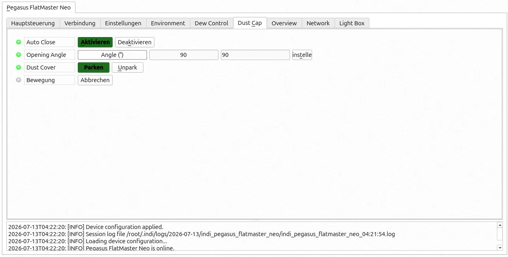
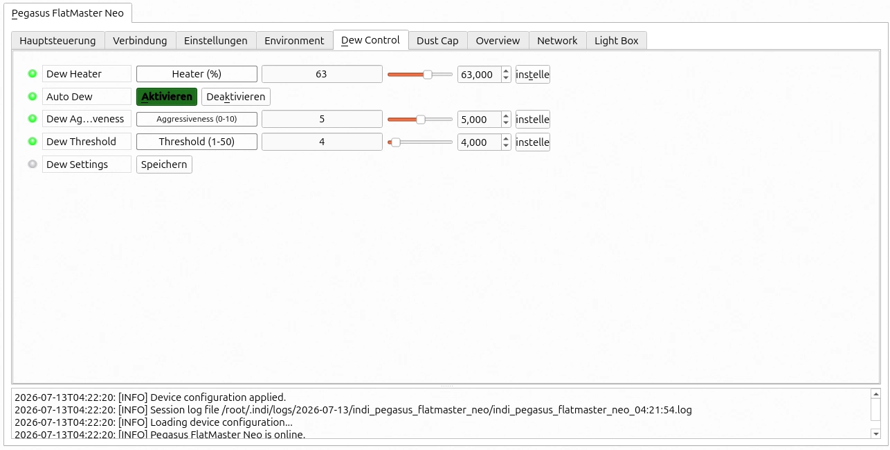
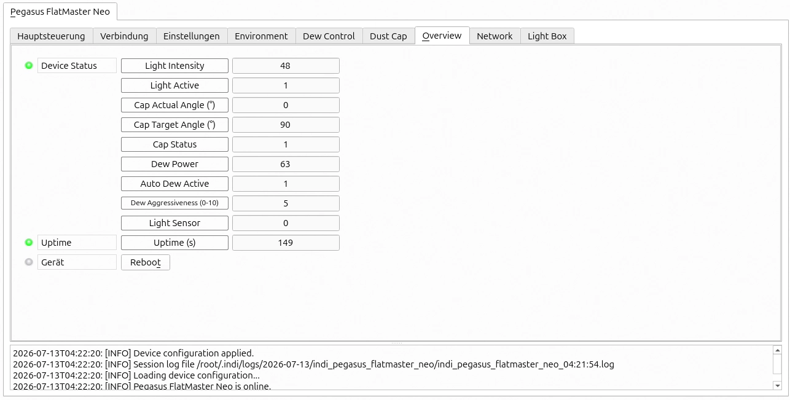

# Pegasus FlatMaster Neo — INDI Auxiliary Driver

This driver supports the Pegasus Astro FlatMaster Neo flat field panel, dust cap control, dew management, environmental sensors, and network/hotspot features via INDI.

## Overview

Implemented INDI interfaces:

- `AUX_INTERFACE`
- `LIGHTBOX_INTERFACE`
- `DUSTCAP_INTERFACE`
- `WEATHER_INTERFACE`

The FlatMaster Neo communicates over USB serial. The driver exposes lightbox on/off and dimming, cap park/unpark and angle control, dew heater and auto dew, temperature/humidity/dew point monitoring, and WiFi/hotspot management.

## Supported Hardware

- Pegasus Astro FlatMaster Neo

## Driver Metadata

- Driver Name: `Pegasus FlatMaster Neo`
- Executable: `indi_pegasus_flatmaster_neo`
- Family: Lightbox, Dustcap
- Manufacturer: Pegasus Astro
- Platforms: Linux, BSD, macOS
- Version: 1.2

## Installing & Running

The driver is included in the INDI core package.

Run it manually using:

```bash
indiserver -v indi_pegasus_flatmaster_neo
```

If you build only this driver from the INDI source tree, the build target is also `indi_pegasus_flatmaster_neo`.

## Connectivity

### USB Serial

The FlatMaster Neo uses a USB serial connection. The driver scans serial ports and matches devices whose system name contains `FlatMaster`.

- Default baud rate: `9600`
- Supported connection: USB serial only
- Network / Bluetooth: not used for the serial interface

### First Time Connection

1. Power on the FlatMaster Neo.
2. Start the driver from an INDI client or manually with `indiserver -v indi_pegasus_flatmaster_neo`.
3. Select the detected serial port or allow automatic scanning.
4. Click Connect.

The driver handshakes with the device using `F#` and expects a response containing `FMNEO`.

## Features

- Lightbox on/off and brightness control (0–100)
- Dust cap park/unpark and target angle control (0–270°)
- Dew heater power control (0–100%)
- Auto dew enable/disable
- Dew aggressiveness level (0–10)
- Dew threshold adjustment (1–50)
- Save dew settings to device memory
- Auto-close cap control
- Temperature, humidity, and dew point sensors
- Temperature and humidity calibration offsets
- Device status overview, including light intensity, cap state, dew state, and light sensor readings
- Firmware version reporting
- Device uptime reporting
- Remote device reboot
- WiFi channel configuration
- Hotspot enable/disable and credentials management
- WiFi network scan and connection
- WiFi factory reset

## Driver Controls

### Firmware

The driver exposes a read-only `Firmware` property showing the reported firmware version.


### Light Box

The `Light Box` tab includes:

- `On/Off`
- `Brightness`

Control commands:

- `FE:0` — disable lightbox
- `FE:1` — enable lightbox
- `FL:<value>` — set brightness


### Dust Cap

The `Dust Cap` tab includes:

- `Open`
- `Close`
- `Angle`

Control commands:

- `FS:0` — park the cap
- `FS:1` — unpark/open the cap
- `CD:<angle>` — set target opening angle



### Dew Control

The `Dew Control` tab includes:

- `Dew Heater` percentage
- `Auto Dew` enable/disable
- `Dew Aggressiveness` level (0–10)
- `Dew Threshold` (1–50)
- `Save Dew Settings`

Control commands:

- `DH:<value>` — set heater power
- `PD:0` / `PD:1` — disable/enable auto dew
- `DA:<level>` — set dew aggressiveness
- `DT:<value>` — set dew threshold
- `DSTR` — save dew settings



### Environment / Weather

The `Environment` tab includes:

- `Temperature`
- `Humidity`
- `Dew Point`
- `Temperature Offset`
- `Humidity Offset`

The driver queries weather data with `ES` and reads/writes offsets with:

- `CR` — read calibration offsets
- `CT:<value>` — set temperature offset
- `CH:<value>` — set humidity offset


### Device Status

The `Overview` tab shows:

- Light intensity
- Light active state
- Cap target angle
- Cap actual angle
- Cap status
- Dew power
- Auto dew active state
- Dew aggressiveness
- Light sensor
- Uptime



### Network

The `Network` tab includes WiFi and hotspot controls:

- `AC` / `AC:<channel>` — read/write WiFi channel
- `A?` / `AE:0` / `AE:1` — hotspot status and enable/disable
- `AL` / `AN:<ssid>` / `AP:<password>` — hotspot credentials
- `WI` — current WiFi connection status
- `WS` — WiFi network scan
- `WN:<ssid>` / `WP:<password>` — connect to WiFi
- `WZ` — WiFi factory reset

## Operation

- Connect the FlatMaster Neo via USB and start the driver.
- Use `Light Box` to control panel power and brightness.
- Use `Dust Cap` to park, unpark, or set the cap angle.
- Use `Dew Control` to manage heater power, auto dew, aggressiveness, threshold, and save settings.
- Monitor temperature, humidity, and dew point in `Environment`.
- Apply calibration offsets when sensor readings differ from a reference.
- Use `Network` for WiFi and hotspot management if supported by your firmware.
- Use `Overview` to verify device state, uptime, and reboot when needed.

## Troubleshooting

- If the driver cannot connect, verify the FlatMaster Neo is powered and visible as a serial device.
- Ensure no other application is using the same serial port.
- Confirm the handshake returns `FMNEO`; otherwise the connected device may not be supported.
- If values do not update, reconnect and ensure the device responds to `FA`, `ES`, and `CR`.
- For network issues, check SSID, password, and WiFi availability.